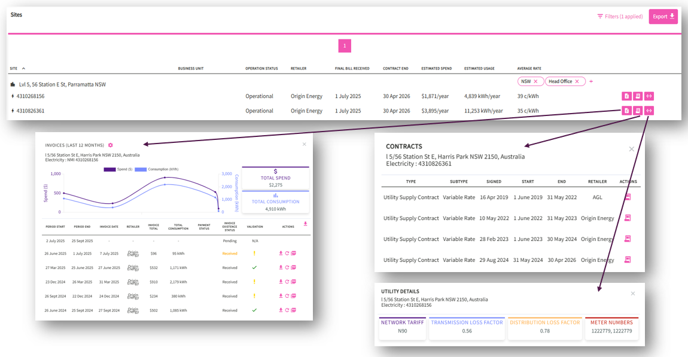
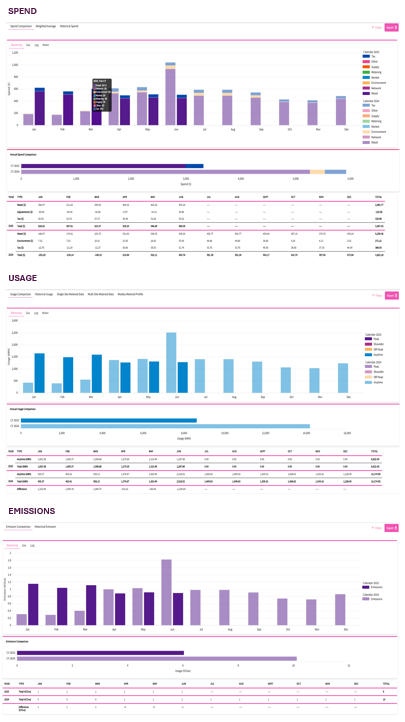

# Unboxing Utilibox
Documentation for Utilibox

Utilibox' portfolio provides a single hub for viewing site-specific energy data.

* Finance assists with payments, overdue alerts, and budgeting.
* Procurement handles contract management and market alerts.
* Net Zero focuses on emissions reporting and net zero strategy analysis. 

Utilibox uses AI to gather and transform data and delivers data integration with self-serve energy data analysis.

## The energy challenge – data integration
**Energy simplified**

Utilibox offers customers a user-friendly way to navigate the often-complex energy markets. Breaking down complicated energy data sets, making things like invoices, meter data, network tariffs, and supply point details easier to understand and manage.

Energy users can now handle their energy data more effectively and without hassle.

## Dashboard
**Energy Basics**

Utilibox is an easy-to-use app that helps you handle all your energy needs. 
* Finds out what's missing:
    * Data from certain sites like invoices and meter data
    * Customer details
    * Details on energy and metering contracts.
* Keeps an eye on energy prices for you.
* Gives you a quick look at your energy situation:
    * Bills to be paid
    * Energy usage
    * Carbon emission
* For help or advice, point of contact information is available
 
Utilibox makes managing your energy simpler and user-friendly.

## Portfolio and Sites
**All your data in one place**

Utilibox’ site page gives customers a simple, single-screen view of all their supply point data, whether it's for electricity, gas, or water, and regardless of the size or metering of the site.

The page also offers access to contract and meter data and even allows customers to look at their recent historical invoices. This makes managing different supply points easier and more straightforward.

## Procurement
**Agile procurement**

Utilibox offers tools for understanding energy market data, handling procurement, and managing contracts. Providing energy market data such as electricity futures, spot prices for electricity and gas, a business contract price index, and environmental certificate prices.

On the contract management side, Utilibox serves as a storage for contract documents, tracking contract prices, and sending alerts about contract end dates. Making it easier for businesses to keep on top of their energy markets and contracts.

## Finance
**Financial efficiency**

Utilibox' finance module is all about making financial tasks simpler:
  * Automating accounts payable tasks
  * Provide spending and accrual files
  * Lets you plan budgets under different scenarios
  * Monitor invoice completion and validation
  
  Also has a feature for uploading bills. Allowing users to improve the quality of their invoice data without depending on others. Its automated invoice processing offers a single digital platform for all finance functions.

## Net Zero
**Zeroing in**

Utilibox' Net Zero feature actively supports users in beginning their journey towards net zero emissions. Offering emissions reporting and supporting net zero strategies.

By providing personalized insights on reducing emissions, Utilibox encourages users to actively participate in lowering their carbon footprint.

## Reports
**Data at your fingertips**

Utilibox' reports feature helps optimise your financial and energy strategies with comprehensive insights.

    * Spend Reports - understand your spending trends and make informed financial decisions.
    * Usage Reports - aids in identifying usage patterns and implementing efficiency measures.
    * Emissions Reports - facilitates the tracking and strategising for businesses carbon reduction efforts.
    

    
## Admin
**Take control**

Utilibox help seamlessly manage your company's details, user roles, and communications all in one centralised hub. Tailor the platform to your corporate identity, efficiently oversee subsidiaries, streamline authorisation processes, and simplify bill handling.

*Organisational Configuration*
Ensures the platform aligns with the company's fiscal calendar and corporate identity. 

*Organisation Tree*
Allows for structured representation and management of your extended entities. Facilitates managing various subsidiaries and associated sites within the broader organisational structure.

*Letter of Authorities (LOA)*
Streamlines authorisation processes, ensuring seamless business operations. Utilibox has a dedicated UI and wizard for adding or crafting LOA’s associated with different company names or ABN’s.

*Mailbox*
Facilitates the receipt and processing of Supplier invoice emails: 
    * Invoices received are auto loaded and processed for payment reporting.
    * Non invoice notifications can be processed by rule, forwarded to specific recipients or groups

*Retailer Portal Logins*
You can securely record your retailer portal login details. This enables automatic scraping of portal logins to download bills. This minimises bill handling, reducing time spent and potential errors.

## Security
### Proactive approach to keeping your data safe

#### ***Two out Three Ain't Bad***
When it comes to authentication, one out of three factors (password-only) is bad.  Multifactor authentication (MFA) on the other hand isn't.  Utilibox employs MFA to ensure that the user attempting to login is who they claim to be, so your data doesn't fall into the wrong hands.

#### *OLA not BOLA*
Utilibox has been written ground-up with customer cybersecurity at the forefront of the architecture.  We have employed stringent Object Level Authorization design which ensures your security amongst our other secure clients.

#### *Australian Privacy Regulations*
Utilibox adheres to the regulations set forth in the Australian Privacy Act 1988. We implement stringent data protection measures, which include encrypted data storage for sensitive data, secure data transfer practices, and regular audits to ensure ongoing compliance.  Our data is stored only within Australian Azure data centers.

#### *Energy Action Employees are Cyber-Guardians*
All Energy Action employees understand that they're integral to our cybersecurity fortress.  Energy Action employees undergo regular cybersecurity training and participate in drills to make sure they can detect and respond quickly and effectively in the event of a security incident.

### **Find out more about how we can support your business energy and emission management**

Visit [energyaction.com.au](energyaction.com.au)
or email us at [info@energaction.com.au](info@energaction.com.au)

